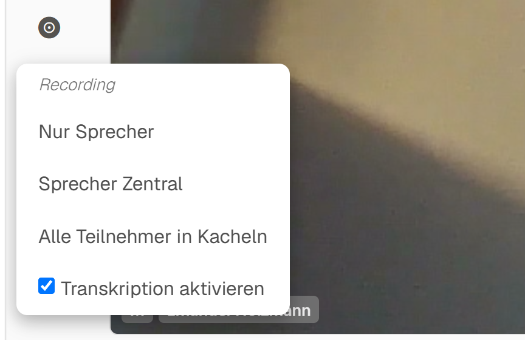
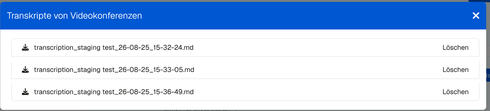
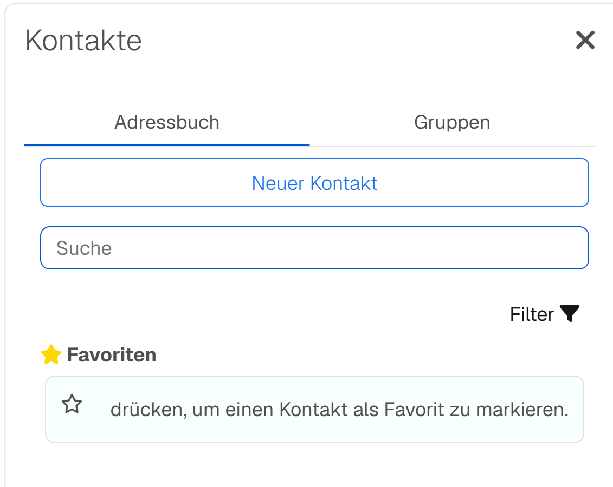

## Meetling 1.5.0 ist da

Mit Version 1.5.0 erhält Meetling eine Reihe sichtbarer Neuerungen, die den täglichen Umgang mit Videokonferenzen einfacher und angenehmer machen. Im Mittelpunkt stehen automatische Transkriptionen, ein deutlich schnelleres Dashboard und eine komplett überarbeitete Startseite. Gleichzeitig haben wir viele kleinere Abläufe verbessert und bekannte Fehler behoben.

## Aufzeichnungen automatisch transkribieren

Die größte neue Funktion sind Transkriptionen von Videokonferenzen. Wenn eine Konferenz aufgezeichnet wird, kann auf Wunsch direkt eine schriftliche Fassung erstellt werden. Die Transkription lässt sich bequem über die Aufzeichnungsoptionen aktivieren.

Sobald die Verarbeitung abgeschlossen ist, steht das Ergebnis im Dashboard beim jeweiligen Raum zum Download bereit. Zusätzlich informiert Meetling per E-Mail darüber, dass die Transkription fertig ist. So lassen sich Besprechungen leichter dokumentieren, durchsuchen und nachbereiten – ohne das gesamte Video noch einmal ansehen zu müssen.

## Schneller zum nächsten Meeting

Das Dashboard wurde umfassend optimiert. Besonders bei Installationen mit vielen Räumen, Terminen und Teilnehmenden werden die Inhalte nun wesentlich schneller geladen. Dadurch reagiert Meetling zügiger und bleibt auch bei umfangreichen Konferenzumgebungen übersichtlich und angenehm bedienbar.

Auch die Startseite präsentiert sich in einem neuen, moderneren Design. Inhalte sind klarer gegliedert, die wichtigsten Informationen schneller erfassbar und die deutsche sowie englische Darstellung besser aufeinander abgestimmt.

## Ein komfortableres Adressbuch

Das Adressbuch wurde an vielen Stellen überarbeitet. Neue Kontakte können jetzt direkt über einen eigenen Dialog hinzugefügt werden. Auch das Anlegen und Bearbeiten von Gruppen funktioniert zuverlässiger.

Aktionen wie das Hinzufügen oder Entfernen von Favoriten werden unmittelbar ausgeführt, ohne dass die gesamte Ansicht neu geladen werden muss. Verständlichere Hinweise helfen außerdem bei ungültigen Eingaben, bereits vorhandenen Kontakten oder doppelt vergebenen Gruppennamen. Gleichzeitig wurden die Darstellung von Namen, Übersetzungen und kleinere Layoutdetails verbessert.

## Zahlreiche Korrekturen im Konferenzalltag

Neben den neuen Funktionen enthält Version 1.5.0 mehrere Fehlerbehebungen, die für einen reibungsloseren Ablauf sorgen:

- Bei einer laufenden Konferenz kann der zugehörige Server nicht mehr versehentlich geändert werden.
- Doppelte Aufrufe bei Aufzeichnungen wurden verhindert.
- Die Schaltflächen in den verschiedenen Lobby-Ansichten werden wieder korrekt angeordnet – auch auf kleineren Bildschirmen.
- Der Dialog zum Hinzufügen eines Termins wird wieder zuverlässig angezeigt und verarbeitet.
- Mikrofon-, Kamera- und Audioelemente in der Lobby verhalten sich konsistenter.
- Die Anzeige von Benutzernamen und die Bedienung einzelner Dialoge wurden korrigiert.

Zusätzlich wurde die Rollenübergabe an die Konferenz erweitert. Dadurch lassen sich die Rechte von Lobby-Moderierenden zuverlässiger an die Videokonferenz übermitteln.

## Jetzt auf Version 1.5.0 aktualisieren

Meetling 1.5.0 verbindet eine große neue Funktion mit vielen Verbesserungen, die im täglichen Einsatz sofort spürbar sind: Besprechungen lassen sich einfacher dokumentieren, das Dashboard lädt schneller und wichtige Bereiche wirken moderner und aufgeräumter.

Alle technischen Details finden Sie in den [Release-Hinweisen zu Version 1.5.0](https://github.com/H2-invent/jitsi-admin/releases/tag/1.5.0). Eine vollständige Übersicht bietet der [Vergleich zwischen Version 1.4.7 und 1.5.0](https://github.com/H2-invent/jitsi-admin/compare/1.4.7...1.5.0).
