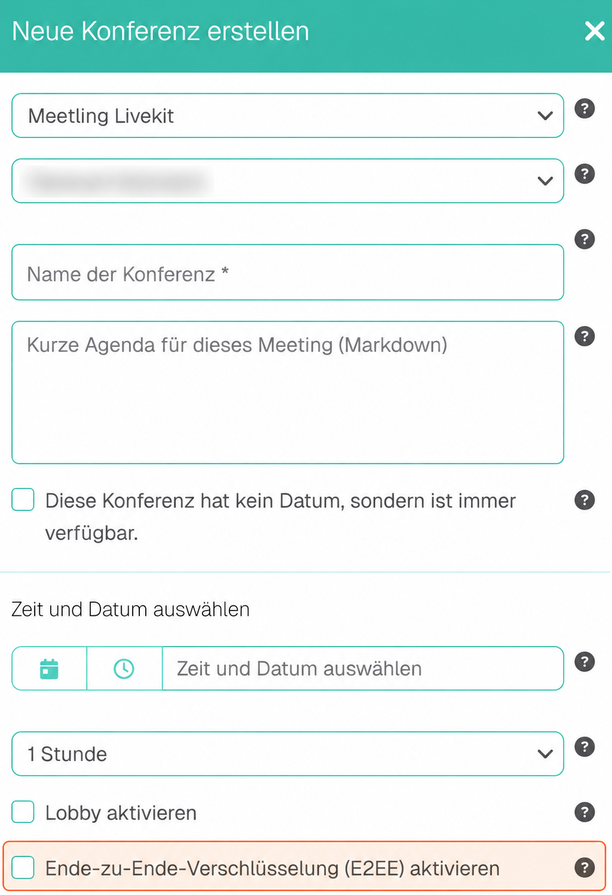

## Vertrauliche Gespräche beginnen mit der Raumplanung

Wenn Sie eine Besprechung über Personalentscheidungen, Vertragsentwürfe oder unveröffentlichte Entwicklungsprojekte vorbereiten, stellt sich eine konkrete Frage: Wer kann die übertragenen Gesprächsinhalte entschlüsseln? **Meetling unterstützt Ende-zu-Ende-Verschlüsselung, kurz E2EE, für Audio- und Videogespräche.** Sie schützt die Inhalte zwischen den Endgeräten der Teilnehmer vor dem Zugriff des dazwischenliegenden Medienservers.

Dafür müssen Sie E2EE **bereits bei der Raumerstellung vorsehen und anschließend über „Bearbeiten“ aktivieren**. Bei aktiver E2EE sind in der hier beschriebenen Meetling-Umsetzung **Telefoneinwahl, Aufnahme und Transkription nicht verfügbar**. Diese Entscheidung gehört deshalb vor die Einladung, damit alle Teilnehmer den vorgesehenen Zugang nutzen können.

## Welche Voraussetzung gilt für E2EE in Meetling?

Sie benötigen eine Meetling-Installation, in der die E2EE-Funktion verfügbar ist. Der [offizielle Meetling-Changelog](https://meetling.de/resources/changelog) führt E2EE als Neuerung von Release **2.10.0** auf. Daraus lässt sich nicht ableiten, welche Version in einer einzelnen Kundeninstallation eingesetzt wird.

Die folgenden Einrichtungsschritte beziehen sich auf den hier gezeigten Meetling-Raum mit LiveKit und den beschriebenen Funktionsstand vom **5. Oktober 2026**. Wenn die E2EE-Option in Ihrer Installation fehlt, klären Sie die Verfügbarkeit mit Ihrer Administration, bevor Sie eine entsprechend geschützte Konferenz planen.

## E2EE vorbereiten und aktivieren

Bei der Raumerstellung finden Sie die Option **„Ende-zu-Ende-Verschlüsselung (E2EE) aktivieren“**. Im folgenden Screenshot ist die Stelle hervorgehoben.

1. **Raum vorbereiten:** Setzen Sie bei der Erstellung den Haken bei „Ende-zu-Ende-Verschlüsselung (E2EE) aktivieren“ und erstellen Sie den Raum mit dieser Einstellung.
2. **Verschlüsselung einschalten:** Öffnen Sie anschließend den vorbereiteten Raum über „Bearbeiten“ und aktivieren Sie dort E2EE.

Die Einstellung bei der Erstellung schafft die Voraussetzung für die anschließende Aktivierung. Planen Sie diese beiden Schritte zusammen ein.

**Empfehlung zur Kontrolle:** Prüfen Sie vor dem Termin in der Raumkonfiguration, dass E2EE eingeschaltet ist. Führen Sie außerdem eine kurze Testkonferenz mit den vorgesehenen Endgeräten durch und prüfen Sie, ob Audio und Video funktionieren. Ein erfolgreicher Verbindungstest allein bestätigt den Verschlüsselungsstatus nicht.

## Warum Telefon, Aufnahme und Transkription entfallen

**Bei aktiver E2EE können die entsprechenden Meetling-Dienste die Gesprächsinhalte nicht entschlüsseln.** Für die Telefoneinwahl müssten sie Audio für das Telefonnetz aufbereiten; für eine Aufnahme müssten sie abspielbare Medien erzeugen; für eine Transkription müssten sie die gesprochenen Worte erkennen.

| Funktion | Bei aktiver E2EE in Meetling | Was der jeweilige Dienst benötigt |
| --- | --- | --- |
| Telefoneinwahl | Nicht verfügbar | Entschlüsseltes Audio zur Weitergabe an das Telefonnetz |
| Aufnahme | Nicht verfügbar | Verarbeitbare Audio- und Videoinhalte für eine abspielbare Aufzeichnung |
| Transkription | Nicht verfügbar | Verarbeitbares Audio für die Umwandlung gesprochener Worte in Text |

Der Medienserver leitet weiterhin verschlüsselte Daten zwischen den Teilnehmern weiter. Die Einschränkung entsteht beim Verarbeiten der Inhalte für diese Zusatzfunktionen. Sie bedeutet nicht, dass E2EE grundsätzlich den Beitritt weiterer berechtigter Videokonferenzteilnehmer verhindert.

Diese Funktionsgrenzen gelten für die hier beschriebene Meetling-Umsetzung. Sie sind keine pauschale Aussage über alle Anwendungen, die E2EE verwenden.

Falls Ihre Besprechung einen Telefonzugang benötigt, hilft der Beitrag zur [Telefoneinwahl mit Lobby-Integration](https://meetling.de/blog/sichere-telefoneinwahl-in-der-lobby) bei der Planung des Einlasses. Diese Telefonfunktion lässt sich in der beschriebenen Umsetzung jedoch nicht gleichzeitig mit aktiver E2EE nutzen.

## Was E2EE schützt – und was Sie weiterhin organisieren müssen

Bei Ende-zu-Ende-Verschlüsselung werden Medieninhalte auf dem sendenden Endgerät verschlüsselt und auf den empfangenden Endgeräten entschlüsselt. Die [offizielle LiveKit-Dokumentation](https://docs.livekit.io/transport/encryption/) erläutert diesen Schutz und grenzt ihn von der Transportverschlüsselung ab. Sie weist auch darauf hin, dass Steuerungsnachrichten und API-Aufrufe, also technische Anfragen zur Verbindung und Verwaltung, nicht Ende-zu-Ende-verschlüsselt sind.

Für Ihren Betrieb bleiben die Auswahl der berechtigten Teilnehmer und der Schutz ihrer Endgeräte wichtig. E2EE verhindert auch nicht, dass ein berechtigter Teilnehmer empfangene Inhalte außerhalb der Meetling-Aufnahmefunktion selbst festhält.

Einen Überblick über die Schutzfunktionen bietet die Seite [Sicherheit und Datenschutz bei Meetling](https://meetling.de/sicherheit). Für die organisatorische Einordnung können Sie die [zehn Prüfkriterien für sichere Videokonferenzen](https://meetling.de/blog/sichere-videokonferenz-10-pruefkriterien) heranziehen.

## Vor der Einladung die benötigten Funktionen klären

Für IT-Verantwortliche und Organisatoren empfiehlt sich eine kurze Abstimmung: Soll die Konferenz mit E2EE stattfinden? Benötigt jemand einen Telefonzugang? Ist eine Aufnahme oder Transkription vorgesehen? Halten Sie die Entscheidung fest und informieren Sie die Teilnehmer über den vorgesehenen Zugang.

Wenn Sie E2EE für vertrauliche Besprechungen einführen möchten, besprechen Sie mit uns Ihre eingesetzte Meetling-Version, die benötigten Zugangswege und die Anforderungen an die Dokumentation. Über das [Kontaktformular auf meetling.de](https://meetling.de/) können Sie diese Fragen direkt an uns richten.
