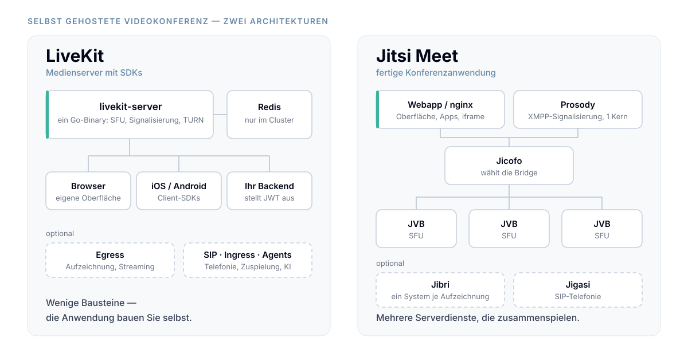

Wer eine Videokonferenz selbst betreiben will, landet früher oder später bei zwei Namen: **LiveKit** und **Jitsi Meet**. Beide sind quelloffen, beide stehen unter der Apache-Lizenz 2.0, beide arbeiten als SFU — als Server, der Medienströme weiterleitet, statt sie neu zu mischen. Und trotzdem sind es zwei sehr unterschiedliche Werkzeuge.

Dieser Beitrag stellt sie gegenüber: Architektur, Skalierung, Verschlüsselung, Aufzeichnung und Integrationsaufwand. Alle Angaben stammen aus der offiziellen Dokumentation und dem Quellcode beider Projekte; die Quellen stehen am Ende.

## Was beide gemeinsam haben

Beide Systeme sind vollständig selbst hostbar, ohne Lizenzkosten und ohne Teilnehmerlimit seitens des Herstellers. Beide verschlüsseln den Transport der Medien per DTLS-SRTP. Beide bieten optional eine zusätzliche Ende-zu-Ende-Verschlüsselung der Medienframes über die Insertable-Streams-API des Browsers — technisch derselbe Ansatz, im Detail unterschiedlich umgesetzt.

Und beide werden aktiv entwickelt: Jitsi Meet von 8x8, LiveKit von LiveKit Inc. In beiden Fällen steht also ein Unternehmen mit einem kommerziellen Hosting-Angebot hinter dem quelloffenen Kern — bei Jitsi „Jitsi as a Service", bei LiveKit „LiveKit Cloud".

## Architektur: eine Anwendung gegen einen Baukasten

Der wichtigste Unterschied ist keiner der Leistungsdaten, sondern des Zuschnitts.

**Jitsi Meet ist eine fertige Videokonferenz.** Es bringt eine Weboberfläche, Apps für iOS und Android sowie eine iframe-API zum Einbetten mit. Serverseitig besteht es aus mehreren Diensten: der Videobridge (JVB) als SFU, Jicofo als Konferenz-Fokus und Lastverteiler, Prosody als XMPP-Server für die Signalisierung, dazu bei Bedarf Jibri für Aufzeichnungen und Jigasi für SIP-Telefonie.

**LiveKit ist ein Medienserver mit SDKs.** Der Server ist ein einzelnes Go-Binary; die Signalisierung läuft über ein eigenes WebSocket-Protokoll, die Authentifizierung über JWT-Tokens, die Ihr Backend ausstellt. Eine Benutzeroberfläche liefert LiveKit nicht mit — es gibt SDKs für Browser, Swift, Kotlin, Flutter, React Native, Rust, Python, ESP32 und weitere sowie fertige React-Komponenten, aber die Anwendung bauen Sie selbst.

Daraus folgt fast alles andere:

| | LiveKit | Jitsi Meet |
|---|---|---|
| Lizenz | Apache 2.0 | Apache 2.0 |
| Technik | Go (Pion WebRTC), Redis für den Cluster | Kotlin/Java (JVB, Jicofo), Prosody (Lua), React |
| Serverdienste minimal | ein Binary | Webapp, Prosody, Jicofo, JVB |
| Signalisierung | eigenes WebSocket-Protokoll, JWT | XMPP |
| Fertige Oberfläche | nein | ja, inklusive Mobile-Apps und iframe-API |
| TURN | eingebaut oder extern | separates coturn |
| Aufzeichnung | Egress (Datei, HLS, RTMP, SRT, Einzelspuren) | Jibri (Datei, Livestream) |
| Telefonie | LiveKit SIP | Jigasi |
| Ende-zu-Ende-Verschlüsselung | ja, Schlüsselverwaltung bei Ihnen | ja, Passphrase in der Oberfläche |

## Skalierung: horizontal in beiden Fällen — mit einem Unterschied

Bei **LiveKit** genügt ein Redis-Eintrag in der Konfiguration, damit der Server im Cluster arbeitet: „when redis is set, LiveKit will automatically operate in a fully distributed fashion". Clients können sich mit jedem Knoten verbinden und werden zum richtigen Raum geroutet. Über den `node_selector` lässt sich die Auswahl nach Systemlast oder Region steuern.

Eine Grenze bleibt: „a room must fit on a single node". Ein einzelner Raum wächst also nur so weit, wie ein Server trägt. Wie weit das ist, dokumentiert LiveKit mit Messwerten für eine 16-Kern-Maschine (`c2-standard-16`): 150 Publisher und 150 Subscriber in 720p bei rund 85 % CPU-Last, oder ein Publisher mit 3.000 Zuschauern beim Streaming.

Bei **Jitsi Meet** ist die Videobridge der erste Engpass, und das Handbuch empfiehlt ausdrücklich, in die Breite zu gehen statt in die Höhe: „4 or 8 CPU with 8 GB RAM seems to be a good configuration" pro Bridge, davon beliebig viele. Jicofo verteilt neue Konferenzen auf die verfügbaren Bridges.

Der interessante Unterschied liegt im Grenzfall: Jitsi kann eine **einzelne Konferenz über mehrere Bridges verteilen**. Mit der regionsbasierten Bridge-Auswahl bekommt jede teilnehmende Person eine Bridge in ihrer Nähe, die Bridges verbinden sich untereinander per Relay. Für weltweit verteilte Großveranstaltungen ist das ein echtes Architekturmerkmal.

Zu beachten ist bei Jitsi außerdem, dass Prosody nur **einen** Prozessorkern nutzt — sehr viele Kerne auf dem Signalisierungsserver bringen daher wenig.

## Ende-zu-Ende-Verschlüsselung: gleicher Mechanismus, andere Politik

Ohne E2EE gilt bei beiden dasselbe Modell: Der Transport ist per DTLS-SRTP verschlüsselt, der Server entschlüsselt die Pakete zum Weiterleiten. Jitsi formuliert das für die Videobridge offen: Die äußere Schicht wird beim Durchlauf entfernt, die Pakete liegen aber „only in memory while being routed to other participants" und werden nicht persistent gespeichert.

Mit E2EE verschlüsseln beide zusätzlich die Medienframes selbst, sodass der Server sie nicht mehr lesen kann. Der Unterschied liegt im Schlüsselmanagement.

**Jitsi Meet** handelt die Schlüssel über die eigene XMPP-Signalisierung mit dem Olm-Protokoll aus — der Double-Ratchet-Implementierung aus dem Matrix-Projekt — und verschlüsselt die Medien mit AES-GCM. In der Oberfläche geben alle Teilnehmenden dieselbe Passphrase ein. Der aktuelle Code enthält zusätzlich eine SAS-Verifikation, mit der sich Teilnehmende gegenseitig bestätigen können; im Whitepaper von 2021 war sie noch nicht enthalten.

Dafür gibt es klare Grenzen, und die sind dokumentiert:

- **20 Teilnehmende.** „E2EE meetings are currently limited to 20 participants due to the signalling overhead." Der Code bestätigt das bis heute: ab 20 Personen zeigt die Oberfläche eine Warnung, ab 25 wird E2EE automatisch abgeschaltet.
- **Keine Telefoneinwahl.** „PSTN access to meetings is not possible when E2EE is used."
- **Nur Audio, Video und Bildschirmfreigabe** — Chat und Umfragen deckt E2EE ausdrücklich nicht ab.
- **Nur Chromium-basierte Browser** (ab Version 83) und der Electron-Client; iOS-Browser nicht, die nativen Apps waren zuletzt in Arbeit.

**LiveKit** verschlüsselt ebenfalls mit AES-GCM, aktiviert auf Raumebene für alle Medienspuren und Datenkanäle. Ein Schlüsselring mit Ratcheting ist eingebaut, und Sie wählen zwischen einem gemeinsamen Raumschlüssel und Schlüsseln je Teilnehmer. Ein festes Teilnehmerlimit für E2EE dokumentiert LiveKit nicht.

Der Preis dafür steht ebenso klar in der Doku: „It is your responsibility to securely generate, store, and distribute encryption keys." LiveKit liefert keine fertige Schlüsselverteilung und keine Verifikationsoberfläche — das ist Ihre Anwendung. Wer das gut macht, bekommt mehr Kontrolle als bei einer Passphrase im Menü; wer es nicht tut, bekommt eine Verschlüsselung, deren Schlüssel überall herumliegen.

Für beide gilt: **Die Signalisierung ist nicht Ende-zu-Ende-verschlüsselt.** Wer im Raum ist, welche Spuren es gibt, wer wann spricht — das sieht der Server. Und jede serverseitige Funktion, die auf den Medieninhalt zugreift (Composite-Aufzeichnung, Transkription, Telefonie), braucht den Schlüssel und muss dafür wie ein Teilnehmer behandelt werden.

## Aufzeichnung: der teuerste Unterschied im Betrieb

Jitsi zeichnet mit **Jibri** auf: Jibri startet eine Chrome-Instanz in einem virtuellen Framebuffer und kodiert deren Ausgabe mit ffmpeg. Das Handbuch ist an dieser Stelle ungewöhnlich deutlich: „Jibri needs ONE system per recording. One Jibri instance = one meeting. For 5 meetings recorded simultaneously, you need 5 Jibris. There is no workaround to that." Für 720p werden mindestens 8 GB RAM je Instanz genannt, für 1280×1024 bereits 12 GB.

LiveKits **Egress** kennt vier Betriebsarten: Room Composite und Web Egress starten ebenfalls Chrome, Track Composite und Track Egress dagegen nutzen direkt das Go-SDK — ohne Browser. Wer nur Einzelspuren archivieren will, spart damit den teuren Teil. Der Dienst rechnet Anfragen zudem mit einem CPU-Kostenmodell gegen die verfügbare Kapazität, statt eine Maschine pro Aufzeichnung zu verlangen. Ausgegeben wird nach S3-kompatiblem Speicher, Azure oder GCP, als MP4, HLS, RTMP, SRT oder Einzelspur.

Wenn regelmäßig mehrere Konferenzen parallel aufgezeichnet werden, ist das der Posten, der die Infrastrukturrechnung dominiert.

## Vor- und Nachteile auf einen Blick

**Jitsi Meet spricht für sich, wenn** Sie schnell eine funktionierende Konferenzlösung brauchen: fertige Weboberfläche, fertige Apps, per iframe in Minuten eingebettet, eine große Community und viel Erfahrungswissen im Netz. E2EE ist ohne Programmierarbeit nutzbar. Und die verteilte Bridge-Architektur trägt sehr große, international verteilte Konferenzen.

**Dagegen spricht:** vier bis sechs Serverdienste, die zusammenspielen müssen; XMPP als Signalisierungsschicht, die man verstehen muss, wenn etwas klemmt; ein Aufzeichnungsmodell, das pro paralleler Aufnahme eine eigene Maschine verlangt; und ein UI-Unterbau, den Sie nur begrenzt umbauen können, ohne einen Fork zu pflegen. Die E2EE-Grenze von 20 Teilnehmenden ist für manche Anwendungsfälle ein Ausschlusskriterium.

**LiveKit spricht für sich, wenn** die Konferenz Teil eines größeren Produkts ist: ein Binary plus Redis, moderne SDKs für praktisch jede Plattform, eingebauter TURN-Server, JWT-basierte Rechtevergabe je Raum und Spur, flexible Aufzeichnung, dazu SIP, Ingress und das Agents-Framework für KI-Teilnehmer. Sie bestimmen die Oberfläche vollständig — und beim Schlüsselmanagement auch die Sicherheitsarchitektur.

**Dagegen spricht:** Ohne eigene Entwicklung gibt es keine Videokonferenz. Sie brauchen ein Backend für die Token-Ausstellung, ein Frontend, eine Rechtelogik — und bei E2EE eine eigene Schlüsselverteilung samt Verifikation. Ein einzelner Raum bleibt außerdem an einen Knoten gebunden.

## Wie man sich entscheidet

Die Frage ist nicht, welches System besser ist, sondern welche Arbeit Sie leisten wollen:

- Sie brauchen **eine Videokonferenz**, möglichst bald, mit vertretbarem Anpassungsbedarf → Jitsi Meet.
- Sie bauen **ein Produkt**, in dem Echtzeitkommunikation nur ein Baustein ist, und wollen Oberfläche, Rechte und Verschlüsselung selbst bestimmen → LiveKit.
- Sie zeichnen **viel und parallel** auf → rechnen Sie beide Modelle mit echten Zahlen durch, bevor Sie sich festlegen.
- Sie brauchen **E2EE mit mehr als 20 Personen** → mit Jitsi Meet geht das heute nicht.

## Warum Meetling auf LiveKit aufbaut

Meetling nutzt LiveKit als Medienserver — aus genau den Gründen, die oben in der Spalte „dagegen" stehen: Wir wollten die Oberfläche, die Rechtelogik und den Umgang mit Schlüsseln selbst in der Hand haben, statt sie von einer mitgelieferten Anwendung vorgegeben zu bekommen. Der Aufwand, den LiveKit den Betreibenden abverlangt, ist bei uns bereits geleistet.

Die [Funktionen](/funktionen) und [Lösungen](/loesungen) von Meetling machen Ihnen die Entscheidung leichter: Sie zeigen, welche Features wir mit LiveKit realisiert haben und wie wir die Architektur für verschiedene Branchen angepasst haben.

## Quellen

Alle Zitate und Zahlen im Text stammen aus diesen Quellen; Stand August 2026.

**LiveKit** — [Server-Repository](https://github.com/livekit/livekit) samt `config-sample.yaml`, [Distributed setup](https://docs.livekit.io/home/self-hosting/distributed/), [Benchmarks](https://docs.livekit.io/home/self-hosting/benchmark/), [Encryption overview](https://docs.livekit.io/home/client/tracks/encryption/) und [Egress](https://github.com/livekit/egress).

**Jitsi Meet** — [Scalable setup](https://jitsi.github.io/handbook/docs/devops-guide/devops-guide-scalable/), [Requirements](https://jitsi.github.io/handbook/docs/devops-guide/devops-guide-requirements/) und [Region-based setup](https://jitsi.github.io/handbook/docs/devops-guide/devops-guide-region/) aus dem Handbook, [Security & Privacy](https://jitsi.org/security/), das [E2EE-Whitepaper 1.0](https://jitsi.org/e2ee-whitepaper/) von 2021 sowie [`react/features/e2ee/constants.ts`](https://github.com/jitsi/jitsi-meet/blob/master/react/features/e2ee/constants.ts) für die Schwellenwerte im aktuellen Code.
