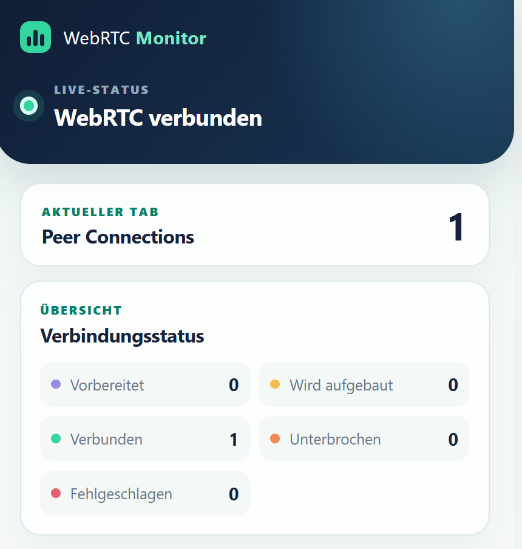
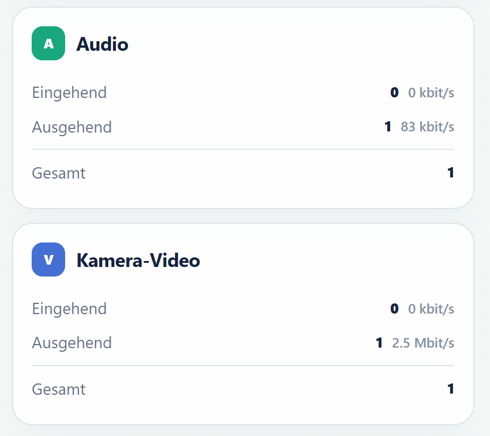

> **KI-generiert:** Dieser Beitrag wurde mit Unterstützung künstlicher Intelligenz erstellt und redaktionell geprüft.

## Wenn eine Videokonferenz läuft – aber niemand weiß, wo es hakt

Bei einer WebRTC-Konferenz können sehr unterschiedliche Probleme zunächst gleich aussehen: Das Mikrofon scheint stumm zu sein, das Kamerabild bleibt schwarz oder eine Bildschirmfreigabe kommt bei den anderen Teilnehmenden nicht an. Die Ursache kann im Endgerät, in einer fehlenden Browserberechtigung, in der Anwendung, in der WebRTC-Verbindung oder im eigentlichen RTP-Medienfluss liegen.

Genau an dieser Stelle setzt der von uns entwickelte [WebRTC Live Monitor](https://chromewebstore.google.com/detail/webrtc-live-monitor/kbebegmekggpljnahfedefocmmkdcijn) an. Die Chrome-Erweiterung zeigt für den aktiven Tab in Echtzeit, welche WebRTC-Verbindungen vorhanden sind, welchen Zustand sie haben und ob Audio-, Video- oder Bildschirmfreigabekanäle tatsächlich Daten übertragen. Das schafft eine kompakte Diagnoseebene zwischen der sichtbaren Benutzeroberfläche einer Konferenz und den umfangreichen Rohdaten aus `chrome://webrtc-internals`.

Obwohl das Werkzeug insbesondere bei der Entwicklung und dem Betrieb von LiveKit-basierten Anwendungen hilfreich ist, ist es bewusst nicht auf LiveKit beschränkt. Es beobachtet standardisierte WebRTC-Schnittstellen des Browsers und funktioniert deshalb grundsätzlich auch mit anderen WebRTC-Anwendungen.

## Was der Monitor sichtbar macht

Nach der Installation öffnet sich WebRTC Live Monitor zunächst als kompaktes Popover. Für längere Tests lässt sich dieselbe Ansicht als dauerhaft sichtbares Chrome-Seitenpanel neben der untersuchten Webseite öffnen. Die Anzeige folgt dabei dem aktiven Browser-Tab und aktualisiert sich live.

Der Monitor zeigt unter anderem:

- die Anzahl offener `RTCPeerConnection`-Instanzen;
- die Zustände `new`, `connecting`, `connected`, `disconnected` und `failed`;
- eingehende und ausgehende Audiokanäle;
- eingehende und ausgehende Kamera-Videokanäle;
- Bildschirmfreigaben als eigene Medienkategorie;
- die aktuelle ein- und ausgehende Bitrate je Medienart;
- im Tab verwendete Mikrofone und Kameras;
- die vom Browser erkannten Audio- und Videogeräte;
- den Status der Kamera- und Mikrofonberechtigungen.

Damit wird aus der pauschalen Aussage „Die Konferenz funktioniert nicht“ eine Reihe konkreter Prüfpunkte. Ist überhaupt eine Peer Connection vorhanden? Bleibt sie beim Verbindungsaufbau hängen? Ist sie verbunden, aber es werden keine RTP-Pakete empfangen? Hat der Tab ein Mikrofon geöffnet? Fehlt der Webseite die erforderliche Berechtigung? Diese Trennung verkürzt die Fehlersuche erheblich.

## Warum WebRTC-Monitoring im Browser anspruchsvoll ist

WebRTC besteht nicht aus einem einzelnen Datenstrom. Eine Anwendung kann mehrere Peer Connections, Transceiver, Sender, Receiver und Medien-Tracks gleichzeitig verwalten. Ein Videokanal kann zudem über Simulcast in mehreren Qualitätsstufen übertragen werden. Redundanz- und Reparaturmechanismen wie RTX, RED, ULPFEC oder FlexFEC erzeugen weitere Statistikobjekte. Würde ein Monitor lediglich alle RTP-Reports zählen, würde aus einem einzigen sichtbaren Videokanal schnell eine irreführend hohe Zahl.

WebRTC Live Monitor zählt deshalb bewusst Medienkanäle und nicht rohe SSRCs oder Encoding-Layer. Mehrere Simulcast-Layer desselben Tracks werden anhand ihrer MID zu einem Kanal zusammengefasst. Statistikreports für Reparaturcodecs werden ausgefiltert. Mehrere tatsächlich unterschiedliche Sender-Tracks bleiben dagegen getrennt sichtbar.

Eine weitere Herausforderung sind vorab angelegte Transceiver. Ein Browser kann bereits einen Receiver und einen Track bereitstellen, obwohl noch kein einziges Medienpaket angekommen ist. Ein reines Zählen vorhandener Tracks würde damit Aktivität melden, die in Wirklichkeit nicht existiert. Der Monitor wertet deshalb die standardisierten `inbound-rtp`- und `outbound-rtp`-Reports aus und zählt einen Kanal erst, nachdem tatsächlich mindestens ein Paket empfangen oder gesendet wurde.

## Von Bytes zur Live-Bitrate

Die WebRTC-Statistik liefert mit `bytesReceived` und `bytesSent` fortlaufende Bytezähler. Diese Werte zeigen, wie viele Daten seit Beginn der Verbindung insgesamt empfangen oder gesendet wurden. Für die Diagnose ist jedoch entscheidend, wie viele Daten **im letzten Messzeitraum** übertragen wurden.

Der Monitor vergleicht deshalb zwei aufeinanderfolgende Messpunkte. Zuerst wird ermittelt, um wie viele Byte der Zähler gestiegen ist. Anschließend wird diese Datenmenge durch die vergangene Zeit geteilt. Da ein Byte aus acht Bit besteht, ergibt sich die Bitrate nach dieser leicht lesbaren Formel:

> **Bitrate in bit/s = übertragene Bytes × 8 ÷ vergangene Sekunden**

Ein Beispiel: Steigt der Bytezähler innerhalb von 2,5 Sekunden um 312.500 Byte, rechnet der Monitor:

> **312.500 Byte × 8 ÷ 2,5 Sekunden = 1.000.000 bit/s**

Das entspricht `1.000 kbit/s` beziehungsweise `1,0 Mbit/s`. Die Oberfläche wählt automatisch die besser lesbare Einheit.

Intern liefert der Browser die Zeitstempel in Millisekunden. Deshalb multipliziert die Implementierung mit `8.000`: Der Faktor `8` wandelt Byte in Bit um, der Faktor `1.000` Millisekunden in Sekunden. Mathematisch ist das dieselbe Berechnung:

> **Bitrate in bit/s = Byte-Differenz × 8.000 ÷ Millisekunden-Differenz**

Beim ersten Messpunkt gibt es noch keinen vorherigen Wert zum Vergleichen. Die Anzeige startet deshalb korrekt bei `0 kbit/s` und kann erst ab der folgenden Messung eine Übertragungsrate berechnen. Die Abfrage erfolgt alle 2,5 Sekunden. Eine Sperre verhindert, dass sich langsamere `getStats()`-Messungen überlappen und dadurch widersprüchliche Ergebnisse entstehen.

## Kamera oder Bildschirmfreigabe?

Im RTP-Report sind Kamera-Video und Bildschirmfreigabe nicht immer zuverlässig unterscheidbar. Für lokale Freigaben löst das Tool dieses Problem, indem es `getDisplayMedia()` instrumentiert. Die dort erzeugten Video-Tracks werden markiert und anschließend über Track-ID beziehungsweise MID den passenden RTP-Reports zugeordnet.

Bei eingehenden Freigaben ist der Monitor auf die Angaben des Browsers beziehungsweise der WebRTC-Anwendung angewiesen. Kennzeichnet ein Report den Inhalt als `screenshare`, `screen`, `window` oder `browser`, kann er separat ausgewiesen werden. Fehlt diese optionale Information, lässt sich ein entfernter Bildschirm-Track technisch nicht zuverlässig von einem Kamera-Track unterscheiden. Der Monitor erfindet in diesem Fall keine Zuordnung, sondern behandelt den Stream als Video. Diese Einschränkung ist wichtig, weil eine Diagnoseanzeige nur dann hilfreich ist, wenn ihre Zahlen nachvollziehbar bleiben.

## Architektur: beobachten, validieren, aggregieren

Die Erweiterung basiert auf Chrome Manifest V3 und trennt ihre Aufgaben in mehrere Sicherheits- und Ausführungskontexte.

### 1. Instrumentierung in der Main World

Ein Content Script wird bereits bei `document_start` in der Main World der Webseite ausgeführt. Dort ersetzt es den globalen `RTCPeerConnection`-Konstruktor durch einen transparenten Wrapper. Jede neu erstellte Verbindung kann dadurch registriert werden, ohne das Verhalten der nativen Verbindung zu verändern.

Zusätzlich beobachtet die Erweiterung relevante Methoden und Ereignisse wie `addTrack()`, `removeTrack()`, `addTransceiver()`, `replaceTrack()`, `track`, `connectionstatechange` und `close()`. Auch `getUserMedia()` und `getDisplayMedia()` werden so eingebunden, dass lokale Geräte-Tracks und Bildschirmfreigaben ihrem Ursprung zugeordnet werden können.

Die Instrumentierung läuft in allen Frames. Das ist relevant, weil Videokonferenzanwendungen Medienlogik nicht zwingend im Hauptdokument ausführen. Eingebettete Frames würden bei einer reinen Top-Level-Beobachtung unsichtbar bleiben.

### 2. Eine validierende Brücke zwischen Seite und Erweiterung

Code in der Main World kann nicht direkt wie ein isoliertes Erweiterungsskript mit allen Chrome-APIs kommunizieren. Deshalb überträgt die Instrumentierung ausschließlich strukturierte Diagnosewerte per `window.postMessage`. Ein zweites Content Script in der isolierten Welt prüft diese Nachrichten und leitet nur gültige Daten an die Erweiterung weiter.

Geprüft werden unter anderem Absenderfenster, Namespace, Protokollversion, Nachrichtentypen, Wertebereiche und konsistente Summen. Bitraten und Zähler müssen nichtnegative, begrenzte Ganzzahlen sein. Die Summe aus ein- und ausgehenden Kanälen muss dem ausgewiesenen Gesamtwert entsprechen.

Diese Validierung begrenzt fehlerhafte oder manipulierte Eingaben. Sie ist jedoch keine kryptografische Vertrauensgrenze: Seitencode im selben Dokument kann den bekannten Nachrichten-Namespace grundsätzlich nachbilden. Die angezeigten Werte sind daher Diagnoseinformationen und dürfen nicht als Grundlage für Sicherheitsentscheidungen verwendet werden.

### 3. Aggregation über Tabs und Frames

Der Service Worker speichert den flüchtigen Zustand getrennt nach Tab, Frame und Dokument. Anschließend aggregiert er die Werte aller Frames eines Tabs, aktualisiert das Badge und informiert Popover oder Seitenpanel über Änderungen.

Diese Trennung verhindert, dass Messwerte verschiedener Konferenzen oder Browser-Tabs miteinander vermischt werden. Navigationen, neu geladene Dokumente, entfernte Frames und geschlossene Tabs lösen eine gezielte Bereinigung aus. Der Zustand liegt in `chrome.storage.session` und bleibt damit bewusst sitzungsbezogen statt dauerhaft gespeichert zu werden.

## Welche Probleme das Tool bei LiveKit löst

LiveKit übernimmt als SFU die Verteilung von Audio-, Video- und Datenströmen. Aus Sicht eines Nutzers bleibt bei einem Fehler aber oft unklar, ob bereits der lokale Browser scheitert oder ob ein Problem erst auf dem weiteren Übertragungsweg entsteht. WebRTC Live Monitor liefert dafür unmittelbare Indikatoren:

- **Keine Peer Connection:** Die Anwendung hat im untersuchten Tab noch keine WebRTC-Verbindung aufgebaut oder die Instrumentierung konnte auf dieser Seite nicht ausgeführt werden.
- **Dauerhaft `connecting`:** Der Verbindungsaufbau ist noch nicht abgeschlossen. Für die genaue Ursache sind anschließend tiefergehende ICE- und Signalisierungsdaten erforderlich.
- **`failed` oder `disconnected`:** Die Peer Connection meldet selbst einen gestörten Zustand. Das grenzt die Ursache klarer von einem reinen UI-Problem ab.
- **Verbunden, aber keine ausgehenden Pakete:** Ein lokaler Track kann fehlen, beendet oder nicht publiziert sein. Auch Berechtigungen und die verwendeten Geräte sollten geprüft werden.
- **Ausgehende Pakete, aber keine eingehenden Pakete:** Die lokale Publikation funktioniert zumindest auf Browserseite; Abonnement, Weiterleitung und Gegenstelle werden dadurch zu den nächsten Prüfpunkten.
- **Bitrate fällt auf null:** Der Kanal existiert weiterhin, im aktuellen Messintervall wächst der Bytezähler aber nicht. Das ist ein wesentlich präziseres Signal als ein bloß vorhandener Track.
- **Bildschirmfreigabe fehlt:** Bei einer lokalen Freigabe lässt sich prüfen, ob `getDisplayMedia()` einen Track geliefert hat und ob dieser tatsächlich als RTP übertragen wird.

Der Monitor ersetzt dabei weder LiveKit-Servermetriken noch Logs, Traces oder `chrome://webrtc-internals`. Er ist vielmehr die schnelle erste Diagnose direkt am betroffenen Browser. Servermonitoring zeigt, was im Cluster passiert; WebRTC Live Monitor zeigt, was der konkrete Tab tatsächlich aufbaut, sendet und empfängt.

## Geräte und Berechtigungen ohne falsche Versprechen

Über `navigator.mediaDevices.enumerateDevices()` zeigt die Erweiterung verfügbare Mikrofone, Lautsprecher und Kameras an. Welche Geräte der aktuelle Tab über `getUserMedia()` tatsächlich geöffnet hat, wird separat dargestellt. Zusätzlich wird der Status der Kamera- und Mikrofonberechtigungen abgefragt.

Chrome liefert jedoch keinen verlässlichen Anschlusstyp wie „USB“, „intern“ oder „Bluetooth“. Ein USB-Gerät kann daher nur dann als solches erkannt werden, wenn seine vom Browser bereitgestellte Bezeichnung einen entsprechenden Hinweis enthält. Vor einer Medienfreigabe anonymisiert der Browser Gerätebezeichnungen häufig. Auch hier zeigt das Tool transparent nur die Informationen an, die der Browser tatsächlich bereitstellt.

## Datenschutzfreundliche Diagnose direkt am Endgerät

Die Analyse findet vollständig lokal im Browser statt. Die Erweiterung zeichnet keine Audio-, Video- oder Bildschirminhalte auf und überträgt keine Telemetrie an externe Server. Sie speichert weder SDP noch IP-Adressen, ICE-Details, Codecs oder einzelne Paketstatistiken. Persistiert werden lediglich begrenzte Zähler, Gerätebezeichnungen, Dokumentzuordnung und Aktualisierungszeit im Session Storage des Browsers.

Der dafür erforderliche Host-Zugriff auf `<all_urls>` ist weitreichend, aber technisch notwendig: Nur so kann die Instrumentierung bei `document_start` auf unterschiedlichen WebRTC-Webseiten und innerhalb ihrer Frames geladen werden. Geschützte Chrome-Seiten, der Chrome Web Store und andere gesperrte Schemes können Erweiterungen grundsätzlich nicht instrumentieren.

## Kompakter Einstieg statt Rohdatenflut

Für eine vollständige WebRTC-Tiefenanalyse bleibt `chrome://webrtc-internals` unverzichtbar. Dort finden sich SDP, ICE-Kandidaten, Codecdetails, Paketverlust, Jitter und zahlreiche weitere Messwerte. Im Supportfall ist diese Informationsmenge jedoch oft mehr, als für die erste Eingrenzung benötigt wird.

WebRTC Live Monitor konzentriert sich deshalb auf eine andere Frage: Läuft in diesem Tab eine Verbindung, welche Medien fließen in welche Richtung und mit welcher aktuellen Datenrate? Diese kompakte Sicht macht das Tool sowohl für Entwicklerinnen und Entwickler als auch für Supportteams und Administratoren unmittelbar nutzbar.

Die Erweiterung steht im [Chrome Web Store](https://chromewebstore.google.com/detail/webrtc-live-monitor/kbebegmekggpljnahfedefocmmkdcijn) bereit. Der vollständige Quellcode ist im [GitHub-Repository](https://github.com/bavxhack/webrtc-plugin-monitor) veröffentlicht.
